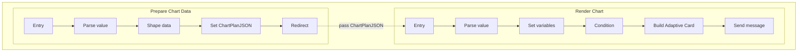

# Copilot Studio + Adaptive Cards Charts Build Guide

## 1. Topic flow diagram

This diagram shows only nodes that live inside the two Copilot Studio topics.



---

## 2. Create the topic scaffolding

Create both topics before configuring any nodes.

### 2.1 Create the Prepare Chart Data topic

Create the first topic with these properties:

| Property | Exact value to use |
|---|---|
| Name | Prepare Chart Data |
| Description | Prepares normalized chart data from a selected dataset so the render topic can build the final Adaptive Card chart. |
| Model display name | Prepare Chart Data |
| Model description | Use this topic when the orchestrator has already selected the dataset to visualize and the data must be prepared for rendering. This topic outputs ChartPlanJSON for the Render Chart topic. |
| Ask the user before running this tool | Off |

Add this topic input:

| Input field | Exact value to use |
|---|---|
| Name | Selected Dataset JSON |
| Variable name | SelectedDatasetJSON |
| How will the agent fill this input? | Dynamically fill with best option |
| Variable data type | String |
| Description | JSON string containing the selected dataset to normalize for chart rendering. |

### 2.2 Create the Render Chart topic

Create the second topic with these properties:

| Property | Exact value to use |
|---|---|
| Name | Render Chart |
| Description | Renders Adaptive Card charts from a normalized chart plan passed in by the orchestrator. |
| Model display name | Render Chart |
| Model description | Use this topic when a dataset has already been selected and normalized for charting. The topic accepts a chart plan JSON payload and returns an Adaptive Card chart such as bar, pie, line, grouped, stacked, or gauge. Do not use this topic to fetch data. |
| Ask the user before running this tool | Off |

Add this topic input:

| Input field | Exact value to use |
|---|---|
| Name | Chart Plan JSON |
| Variable name | ChartPlanJSON |
| How will the agent fill this input? | Dynamically fill with best option |
| Variable data type | String |
| Description | JSON string containing the chart plan to render, including chartType, titles, and the selected chart data payload. |

After creating both topic shells, configure the redirect and complete the node setup.

---

## 3. Configure Prepare Chart Data nodes

Use the Prepare Chart Data topic you created in Section 2.1.

Prepare Chart Data accepts the dataset selected by the orchestrator, converts it into `Topic.ChartPlanJSON`, and redirects to Render Chart.

### 3.1 Node 1: Trigger / topic entry node

Configure the trigger and input value on this node as follows.

1. Open the topic trigger card.
2. Leave **The agent chooses** enabled.
3. In **Describe what the topic does**, paste this exact text:

   Use this topic when the orchestrator has already selected the dataset to visualize and the data must be prepared for rendering. This topic outputs ChartPlanJSON for the Render Chart topic.

4. Open **Topic details**.
5. On the **Topic details** tab, confirm the property values listed above.
6. Open the **Input** tab.
7. Add this input variable.

| Input field | Exact value to use |
|---|---|
| Name | Selected Dataset JSON |
| Variable name | SelectedDatasetJSON |
| How will the agent fill this input? | Dynamically fill with best option |
| Variable data type | String |
| Description | JSON string containing the selected dataset to normalize for chart rendering. |

After configuring the trigger and input, continue to Node 3.2.

### 3.2 Node 2: Parse value node

Add a **Parse value** node immediately after the entry node.

Use this node to convert the incoming `Topic.SelectedDatasetJSON` string into an internal record named `Topic.SelectedDataset` that the shaping step can reference.

Use the following settings in the Parse value node:

| Field in the UI | Exact value to use | Why |
|---|---|---|
| Parse value | `SelectedDatasetJSON` | This is the incoming dataset string from the orchestrator |
| Data type | `Record` | The selected dataset is being passed as a JSON object |
| Edit schema | Use the sample JSON shown below under **Schema source for SelectedDatasetJSON** | This defines the fields available to the shaping step |
| Save as | `SelectedDataset` | This creates the internal record used by Node 3.3 |

When you click the saved variable on the right-side panel, use these settings:

| Field | Exact value to use |
|---|---|
| Variable name | `SelectedDataset` |
| Type | `record` |
| Usage | `Topic (limited scope)` |
| Receive values from other topics | `Off` |
| Return values to original topics | `Off` |
| Sensitive data | `Off` by default |

#### Schema source for SelectedDatasetJSON

Use this sample JSON to generate the schema for Node 3.2:

```json
{
  "title": "Songs Released by Genre",
  "preferredChartType": "horizontalBar",
  "xAxisTitle": "Genre",
  "yAxisTitle": "Songs Released",
  "rows": [
    { "label": "Blues", "value": 433 },
    { "label": "Classical", "value": 271 },
    { "label": "Rock", "value": 6752 }
  ],
  "normalizedRows": [
    { "category": "Blues", "value": 433 },
    { "category": "Classical", "value": 271 },
    { "category": "Rock", "value": 6752 }
  ]
}
```

Use the following JSON template as the `SelectedDatasetJSON` schema for Topic 1. Node 3.3 transforms this structure into the normalized `Topic.ChartPlanJSON` contract used by Topic 2.

### 3.3 Node 3: Set variable value or shaping step

Add a **Set a variable value** node immediately after the Parse value node.

This node creates the normalized chart plan that Topic 2 will consume.

Configure the node as follows:

1. Add a **Set a variable value** node.
2. For **Variable to set**, choose `Topic.ChartPlanJSON`.
3. In the formula box, paste the following formula.
4. Save the node.

Formula:

```powerfx
JSON(
    {
        chartType: If(
            IsBlank(Text(Topic.SelectedDataset.preferredChartType)),
            "horizontalBar",
            Text(Topic.SelectedDataset.preferredChartType)
        ),
        title: If(
            IsBlank(Text(Topic.SelectedDataset.title)),
            "Results",
            Text(Topic.SelectedDataset.title)
        ),
        xAxisTitle: If(
            IsBlank(Text(Topic.SelectedDataset.xAxisTitle)),
            "Category",
            Text(Topic.SelectedDataset.xAxisTitle)
        ),
        yAxisTitle: If(
            IsBlank(Text(Topic.SelectedDataset.yAxisTitle)),
            "Value",
            Text(Topic.SelectedDataset.yAxisTitle)
        ),
        colorSet: "categorical",
        normalizedRows: If(
            CountRows(Topic.SelectedDataset.normalizedRows) > 0,
            ForAll(
                Topic.SelectedDataset.normalizedRows,
                {
                    category: Text(ThisRecord.category),
                    value: Value(ThisRecord.value)
                }
            ),
            ForAll(
                Topic.SelectedDataset.rows,
                {
                    category: Text(ThisRecord.label),
                    value: Value(ThisRecord.value)
                }
            )
        )
    }
)
```

Expected `SelectedDatasetJSON` schema:
- `title`
- `preferredChartType`
- `xAxisTitle`
- `yAxisTitle`
- either `rows[]` with `label` and `value`
- or `normalizedRows[]` with `category` and `value`

The resulting value stored in `Topic.ChartPlanJSON` is the normalized contract used by the Render Chart topic.

### 3.4 Node 4: Redirect node to Render Chart

Add a **Redirect** node as the final step in this topic.

Map the redirect input explicitly as follows:

| Target topic input | Value to pass from this topic |
|---|---|
| `Chart Plan JSON` / `ChartPlanJSON` | `Topic.ChartPlanJSON` |

If the UI shows `ChartPlanJSON = ChartPlanJSON` inside **Prepare Chart Data**, that is usually correct: the left side is the **target topic input** and the right side is the **current topic variable** being passed into it.

Do **not** pass `Topic.SelectedDatasetJSON` directly into the Render Chart topic.

If this mapping is left blank or the wrong variable is passed, the chart often renders as an empty axis with a `0` label and default titles such as `Category` and `Value`.

This completes the Prepare Chart Data topic.

---

## 4. Configure Render Chart nodes

Use the Render Chart topic you created in Section 2.2.

Render Chart accepts `Topic.ChartPlanJSON`, parses the record, builds the Adaptive Card JSON, and sends the chart into the chat.

### 4.1 Node 1: Topic entry / redirect target node

Create the topic entry node first.

Configure the topic entry node to receive `Topic.ChartPlanJSON` from Prepare Chart Data.

### 4.2 Node 2: Parse value node

Add a **Parse value** node immediately after the topic entry node.

Its job is to take the incoming string input `Topic.ChartPlanJSON` and convert it into a typed record variable named `Topic.ChartPlan` that the rest of the topic can reference.

Configure the node in this order:

1. Set **Parse value** to `ChartPlanJSON`.
2. Set **Data type** to **From sample data**.
3. When Copilot Studio asks for the sample JSON, paste the JSON template from the **Schema source** block below.
4. Save the parsed record as `ChartPlan`.

#### What to put in each Parse value field

Apply the following Parse value settings:

| Field in the UI | Exact value to use | Why |
|---|---|---|
| Parse value | `ChartPlanJSON` | This is the incoming topic input string |
| Data type | `From sample data` | This lets you paste the JSON template and generate the record schema immediately |
| Edit schema / sample JSON | Paste the JSON template shown below under **Schema source** | This generates the record schema Copilot Studio should use for `ChartPlan` |
| Save as | `ChartPlan` | This becomes the internal parsed record used later in formulas |

#### Schema source

Use this sample JSON to generate the schema:

```json
{
  "chartType": "horizontalBar",
  "title": "Songs Released by Genre",
  "xAxisTitle": "Genre",
  "yAxisTitle": "Songs Released",
  "colorSet": "categorical",
  "value": 72,
  "normalizedRows": [
    { "category": "Blues", "value": 433, "series": "Default" }
  ],
  "data": [
    {
      "legend": "Rock",
      "values": [
        { "x": "2026-01", "y": 120 }
      ]
    }
  ],
  "stackedBarData": [
    {
      "title": "Rock",
      "data": [
        { "legend": "Used", "value": 72, "color": "good" },
        { "legend": "Unused", "value": 28, "color": "neutral" }
      ]
    }
  ],
  "segments": [
    { "legend": "Used", "size": 72 },
    { "legend": "Unused", "size": 28, "color": "neutral" }
  ]
}
```

This sample is intentionally broader than any one chart instance. It exists so the parsed schema can support multiple chart types with one contract.

#### Variable properties for `ChartPlan`

When you click the saved variable on the right-side panel, use these settings:

| Field | Exact value to use |
|---|---|
| Variable name | `ChartPlan` |
| Type | `record` |
| Usage | `Topic (limited scope)` |
| Receive values from other topics | `Off` |
| Return values to original topics | `Off` |
| Sensitive data | `Off` by default |

`ChartPlan` should be an internal working variable created by the Parse value node. It should **not** be a topic input.

#### How the parsed schema maps the incoming chart plan

The Parse value step maps the JSON by property name. It does not infer meaning from an arbitrary chart payload.

The orchestrator should send the normalized chart plan contract used in this guide.

- If `chartType` is `pie`, the render topic will read `normalizedRows`
- If `chartType` is `horizontalBar`, the render topic will also read `normalizedRows`
- If `chartType` is `line`, `verticalBarGrouped`, or `verticalBarStacked`, the render topic will read `data`
- If `chartType` is `horizontalBarStacked`, the render topic will read `stackedBarData`
- If `chartType` is `gauge`, the render topic will read `value` and `segments`

Example pie payload:

```json
{
  "chartType": "pie",
  "title": "Songs by Genre",
  "normalizedRows": [
    { "category": "Rock", "value": 6752 },
    { "category": "Blues", "value": 433 }
  ]
}
```

Example line payload:

```json
{
  "chartType": "line",
  "title": "Songs Released Over Time",
  "xAxisTitle": "Month",
  "yAxisTitle": "Songs",
  "data": [
    {
      "legend": "Rock",
      "values": [
        { "x": "2026-01", "y": 120 },
        { "x": "2026-02", "y": 150 }
      ]
    }
  ]
}
```

Raw Adaptive Card chart JSON does not map to this contract and should not be passed into the Parse value node.

### 4.3 Node 3: Set variable value nodes for defaults and routing

Add five **Set a variable value** nodes.

Use these exact **topic variable names** in the node configuration:

- `ChartType`
- `ChartTitle`
- `XAxisTitle`
- `YAxisTitle`
- `ColorSet`

In Copilot Studio, select the topic variable named above. The expression can reference `Topic.<VariableName>`, but the variable name itself should be the plain name such as `ChartType`, not the literal text `Topic.ChartType`.

#### Set variable: `ChartType`

Value:

```powerfx
Lower(Text(Topic.ChartPlan.chartType))
```

#### Set variable: `ChartTitle`

Value:

```powerfx
Coalesce(Text(Topic.ChartPlan.title), "Results")
```

#### Set variable: `XAxisTitle`

Value:

```powerfx
Coalesce(Text(Topic.ChartPlan.xAxisTitle), "Category")
```

#### Set variable: `YAxisTitle`

Value:

```powerfx
Coalesce(Text(Topic.ChartPlan.yAxisTitle), "Value")
```

#### Set variable: `ColorSet`

Value:

```powerfx
Coalesce(Text(Topic.ChartPlan.colorSet), "categorical")
```

### 4.4 Node 4: Condition node for chart type

Add a **Condition** node and branch by `Topic.ChartType`.

Example condition for the horizontal bar branch:

```powerfx
Topic.ChartType = "horizontalbar"
```

Example condition for the pie branch:

```powerfx
Topic.ChartType = "pie"
```

Example condition for the line branch:

```powerfx
Topic.ChartType = "line"
```

Example condition for the grouped vertical bar branch:

```powerfx
Topic.ChartType = "verticalbargrouped"
```

Example condition for the stacked vertical bar branch:

```powerfx
Topic.ChartType = "verticalbarstacked"
```

Example condition for the horizontal stacked bar branch:

```powerfx
Topic.ChartType = "horizontalbarstacked"
```

### 4.5 Node 5: Adaptive Card formula for each chart branch

In each chart branch, add a **Send a message** node, add an **Adaptive card**, switch it to **Formula card**, and paste the matching formula below directly into that card.

#### Horizontal bar branch

```powerfx
{
    type: "AdaptiveCard",
    version: "1.5",
    body: [
        {
            type: "Chart.HorizontalBar",
            title: Text(Topic.ChartTitle),
            xAxisTitle: Text(Topic.XAxisTitle),
            yAxisTitle: Text(Topic.YAxisTitle),
            colorSet: Text(Topic.ColorSet),
            data: ForAll(
                Topic.ChartPlan.normalizedRows,
                {
                    x: Text(ThisRecord.category),
                    y: Value(ThisRecord.value)
                }
            )
        }
    ]
}
```

#### Pie branch

```powerfx
{
    type: "AdaptiveCard",
    version: "1.5",
    body: [
        {
            type: "Chart.Pie",
            colorSet: Text(Topic.ColorSet),
            data: ForAll(
                Topic.ChartPlan.normalizedRows,
                {
                    legend: Text(ThisRecord.category),
                    value: Value(ThisRecord.value)
                }
            )
        }
    ]
}
```

#### Line branch

```powerfx
{
    type: "AdaptiveCard",
    version: "1.5",
    body: [
        {
            type: "Chart.Line",
            title: Text(Topic.ChartTitle),
            xAxisTitle: Text(Topic.XAxisTitle),
            yAxisTitle: Text(Topic.YAxisTitle),
            colorSet: Text(Topic.ColorSet),
            data: Topic.ChartPlan.data
        }
    ]
}
```

#### Grouped vertical bar branch

```powerfx
{
    type: "AdaptiveCard",
    version: "1.5",
    body: [
        {
            type: "Chart.VerticalBar.Grouped",
            title: Text(Topic.ChartTitle),
            xAxisTitle: Text(Topic.XAxisTitle),
            yAxisTitle: Text(Topic.YAxisTitle),
            colorSet: Text(Topic.ColorSet),
            data: Topic.ChartPlan.data
        }
    ]
}
```

#### Stacked vertical bar branch

```powerfx
{
    type: "AdaptiveCard",
    version: "1.5",
    body: [
        {
            type: "Chart.VerticalBar.Grouped",
            stacked: true,
            title: Text(Topic.ChartTitle),
            xAxisTitle: Text(Topic.XAxisTitle),
            yAxisTitle: Text(Topic.YAxisTitle),
            data: Topic.ChartPlan.data
        }
    ]
}
```

#### Horizontal stacked bar branch

```powerfx
{
    type: "AdaptiveCard",
    version: "1.5",
    body: [
        {
            type: "Chart.HorizontalBar.Stacked",
            title: Text(Topic.ChartTitle),
            data: Topic.ChartPlan.stackedBarData
        }
    ]
}
```

#### Gauge branch

```powerfx
{
    type: "AdaptiveCard",
    version: "1.5",
    body: [
        {
            type: "Chart.Gauge",
            title: Text(Topic.ChartTitle),
            showTitle: true,
            value: Value(Topic.ChartPlan.value),
            valueFormat: "fraction",
            segments: Topic.ChartPlan.segments
        }
    ]
}
```

### 4.6 Node 6: Send a message node

Add a **Send a message** node to the active chart branch and use it to return the chart.

Configure the node as follows:

1. Add a **Send a message** node after the matching chart condition.
2. On the node toolbar, select **Add** and then select **Adaptive card**.
3. Open the Adaptive Card **Properties** panel.
4. Switch the card to **Formula card**.
5. Paste the full matching chart formula from Section 4.5 into the card and save the node.

---

## 5. Supplemental guidance

### 5.1 How the orchestrator should choose the chart type

Use these rules:
- pie for one label column and one numeric column with a small number of categories
- horizontal bar for rankings and top-N comparisons
- line for dates or ordered time periods
- grouped vertical bar for multi-series comparison
- stacked vertical bar for totals and composition across categories
- gauge for one KPI or one percentage

### 5.2 Example normalization from a returned table

If the data agent returns a table like this:

| Genre | Songs Released |
|---|---:|
| Blues | 433 |
| Classical | 271 |
| Country | 1,508 |
| Rock | 6,752 |

The orchestrator should infer:
- `Genre` maps to the category field
- `Songs Released` maps to the value field
- no series field is needed
- a horizontal bar or pie chart is appropriate

### 5.3 Keep the formulas fixed

Do not write a different topic formula for every dataset.

Instead, keep the topic formulas stable and make the orchestrator normalize the selected dataset into the chart plan before the topic is called.

### 5.4 Best practices

- keep the render topic presentation-focused
- let the orchestrator decide which dataset should be charted
- do top-N limiting and sorting in the data query or orchestrator layer
- use line charts only when the x-axis is time ordered
- keep gauge values on a 0 to 100 scale
- render one chart per topic invocation

### 5.5 Optional topic inputs, internal variables, and validation

Optional topic inputs include:
- `Topic.PreferredChartType`
- `Topic.ChartTitleHint`
- `Topic.XAxisTitleHint`
- `Topic.YAxisTitleHint`

These inputs can be used to override chart selection or display labels when the orchestrator needs more control.

The Render Chart topic may also use internal variables such as:
- `Topic.ChartPlan`
- `Topic.ChartType`
- `Topic.ChartTitle`
- `Topic.XAxisTitle`
- `Topic.YAxisTitle`
- `Topic.ColorSet`

These are internal working variables, not required topic inputs.

You can also add a **Condition** node before the redirect if you want to validate the dataset before rendering.

Use a condition like this:

```powerfx
And(
    !IsBlank(Text(First(Topic.SelectedDataset.rows).label)),
    !IsBlank(Text(First(Topic.SelectedDataset.rows).value))
)
```

If the condition returns true, redirect to **Render Chart**. If it returns false, stop the topic or return a fallback message.

### 5.6 Troubleshooting the blank-chart output

If you see a chart with only axis lines, a single `0` label, or a generic `Something went wrong` message, the problem is usually the incoming payload shape rather than the chart control itself.

Check these items first:

- The orchestrator must call **Prepare Chart Data** first and pass `SelectedDatasetJSON`
- The redirect into **Render Chart** must pass `ChartPlanJSON` exactly
- Use the exact variable names `SelectedDatasetJSON` and `ChartPlanJSON` with uppercase `JSON`
- Do not pass a raw markdown table, raw Adaptive Card JSON, or the original query result directly into **Render Chart**
- For a horizontal bar or pie chart, the plan must contain `normalizedRows`
- In **Prepare Chart Data**, add a temporary **Send a message** node before the redirect and output `Topic.ChartPlanJSON`; verify that the message shows valid JSON with `chartType`, `title`, and a populated `normalizedRows` array

For the music example shown in this guide, the payload passed into **Prepare Chart Data** should look like this:

```json
{
  "title": "Songs Released in 1996 by Genre",
  "preferredChartType": "horizontalBar",
  "xAxisTitle": "Genre",
  "yAxisTitle": "Songs Released",
  "rows": [
    { "label": "Rock", "value": 1505 },
    { "label": "Country", "value": 609 },
    { "label": "Pop", "value": 570 },
    { "label": "Folk", "value": 543 },
    { "label": "Hip-Hop", "value": 455 }
  ]
}
```

If you want to test **Render Chart** directly, pass this normalized `ChartPlanJSON` instead:

```json
{
  "chartType": "horizontalBar",
  "title": "Songs Released in 1996 by Genre",
  "xAxisTitle": "Genre",
  "yAxisTitle": "Songs Released",
  "colorSet": "categorical",
  "normalizedRows": [
    { "category": "Rock", "value": 1505 },
    { "category": "Country", "value": 609 },
    { "category": "Pop", "value": 570 },
    { "category": "Folk", "value": 543 },
    { "category": "Hip-Hop", "value": 455 }
  ]
}
```

If your debug output shows `"normalizedRows": null`, that confirms the source payload reaching **Prepare Chart Data** does not contain a usable `rows` array with `label` and `value` fields. Fix the upstream payload first; the Render Chart formulas are not the part failing in that case.
